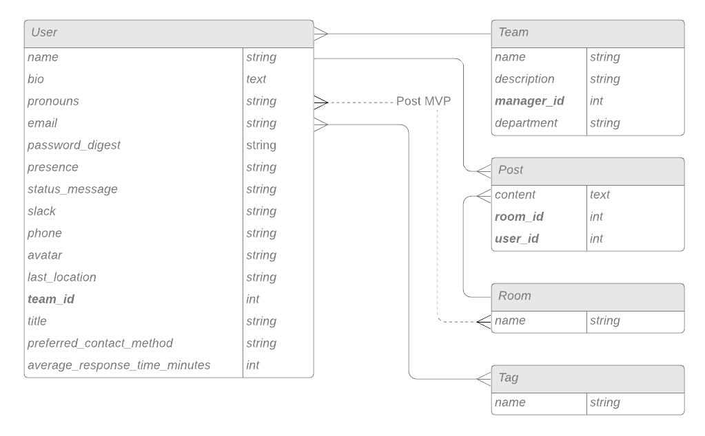
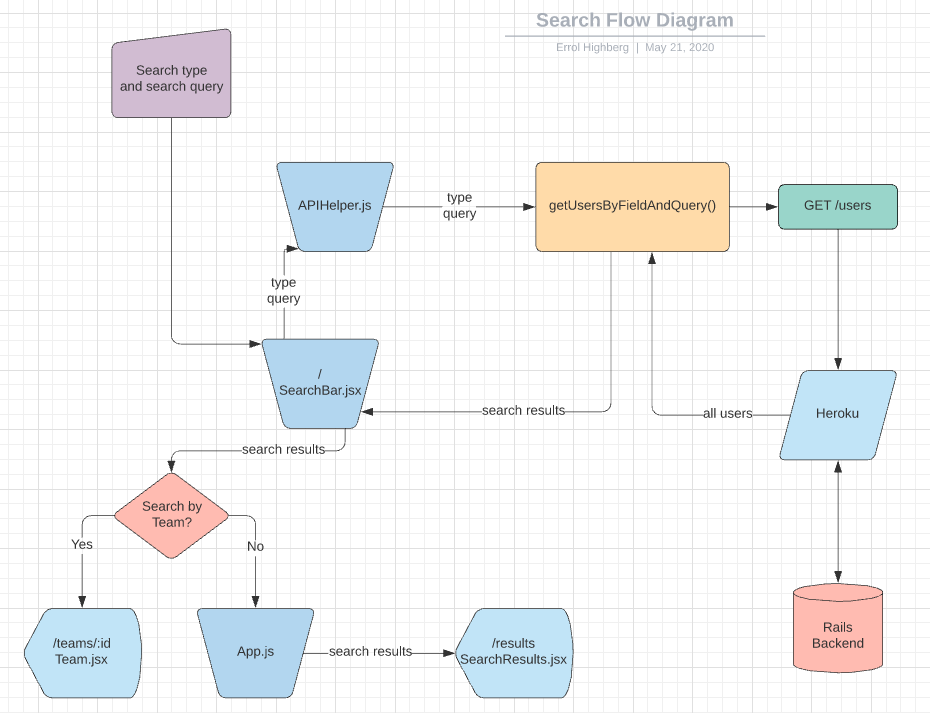

# PROJECT NAME

  - [Overview](#Overview)
  - [Team](#Team)
  - [MVP](#MVP)
    - [MVP Goals](#MVP-Goals)
    - [MVP Libraries](#MVP-Libraries)
    - [MVP Client (Front End)](#MVP-Client-Front-End)
      - [Wireframes](#Wireframes)
      - [Component Hierarchy](#Component-Hierarchy)
      - [Component Breakdown](#Component-Breakdown)
    - [MVP Server (Back End)](#MVP-Server-Back-End)
      - [ERD Model](#ERD-Model)
    - [Data Flow](#Data-Flow)
  - [Post-MVP](#Post-MVP)
  - [Code Showcase](#Code-Showcase)
  - [Code Issues & Resolutions](#Code-Issues--Resolutions)

 

## Overview

**PROJECT NAME** is a workplace communication and informational tool. It
incorporates real-time chat with ActionCable connection to a Ruby on Rails
server, as well as a directory service organizing employees by their team,
expertise, etc.

## Team

- David Coughlin - User Experience Designer
- Errol Highberg - Software Developer
- Tara Solbrig - Software Developer
- Trevor Smith-Holbourn - Software Developer
- Valeria Gonzalez - User Experience Designer

 

## MVP

One core feature is an employee directory system which users can search by
employee name, team, or self-defined tags (skills, hobbies, etc.). These
searches can be used to start chats directly (with an entire team, for
example), as well as look up contact information for specific people.

### MVP Libraries and external APIs

|     Library      | Description                                |
| :--------------: | :----------------------------------------- |
| React            | _Front end framework for reusable components._ |
|   React Router   | _In-app routing to make single page application._ |
|     Axios        | _Simpler interface for getting data to/from front end._ |
|      Formik      | _Simpler form handling in React by reducing boilerplate._ |
|    Faker         | _Generate seed data for fast development._          |
| Ruby on Rails    | _Backend server with easy database and routing setup._ |
| CORS             | _Allow Cross Origin Resource Sharing in development._ |
| Tailwind CSS     | _Reduce boilerplate CSS for fast development._ |
| ActionCable.js   | _Real-time updates interfacing with Rails backend._ |
| React-Swipeable  | _Add swipe gestures for improved mobile experience._ |
| React-Interactions | _Component library for designing micro-interactions._ |

 

### MVP Client (Front End)

#### Wireframes

#### Component Hierarchy

#### Component Breakdown

| Page | Description                                                    |
| :----------: | :----------------------------------------------------: |
| FourNaughtFour | 404 error handling. |
| Home | Login, search, and directory access. |
| Login | User login, and landing page if not logged in. |
| RoomListPage | List all chat rooms. |
| RoomPage | Handles display and creation of posts in a chat room.|
| SearchResults | Display results of search. |
| Team | Display members of a team. |
| TeamList | Display all teams and their team leaders. |
| UserProfile | Display status updats and contact info for a single user. |
| UserProfilePage2 | Display bio, interests, and social activity for a single user. |
| UserProfilePage3 | Display pictures for a single user. |
| UserProfilePage4 | Display Essence for a single user. |

| Component | Description                                               |
| :----------: | :----------------------------------------------------: |
| Avatar | Display picture, name, and title of user. |
| AvatarSmall | Smaller picture, name, and title of user. |
| Bio | Display user bio information. |
| Contact | Display contact info, including preferred method and average response time. |
| DotLink | Display the three dots used in links. |
| Interests | Display user interests. |
| Nav | Site navigation. |
| Pics | Display user's pictures. |
| Post | Display a single post in a room, including user name and picture. |
| PostForm | Submit posts to rooms. |
| Presence | Online / away / offline status of user. |
| ProfileNav | Click and swipe navigation through user profile. |
| Room | Displays posts in a chat room, with their author and time. |
| RoomCard | Summary info for a room. |
| RoomList | List all chat rooms. |
| SearchBar | Query by search type and string input. |
| Status | Incorporates presence and away message. |
| UserCard | Summary information for a single user. |
| UserList | Display a collection of UserCards. |

 

### MVP Server (Back End)

#### ERD Model

#### Endpoints

- GET `/users`
	- Index route returning all users
- GET `/users/:id`
  - Show route returning a single user requested by ID

 

- GET `/rooms`
  - Index route returning a list of all chat rooms
- GET `/roomwithdetails/:id`
  - Show route for a single chat room with all its posts and user info

 

- POST `/posts`
  - Create route which adds a post to a room

 

- GET `/teams`
  - Index route returning all teams

 

### Data Flow

***

## Post-MVP

- Highlighting team leader in team search
- Send email from app
- Share documents and / or media
- More micro-interactions
- Chat rooms are only visible to participants
- Users can sticker good posts
- FAQ links on user profiles
- Interests section in user profiles
- Add department summary page
- Animated dropdown from team list, displaying members of that team
- Tooltips for contact methods on user profiles
- User profile "schedule a meeting" button redirecting to Calendly

 

***

## Code Showcase

## Code Issues & Resolutions

### Expected Issues

- Making sockets work for real time chat rooms.
- Displaying profile information effectively to users.
- Time management on short deadline.
- Dynamic generation and access to chat rooms.

### Encountered Issues

- Seeding self-referencing tables. Fixed by aliasing one of the table references.
- Development at the same time as design is very tough. Mitigated with about 3 meetings per day.
- Original design called for single search bar to search all fields. Added drop down search bar to allow selection of search type.

***
